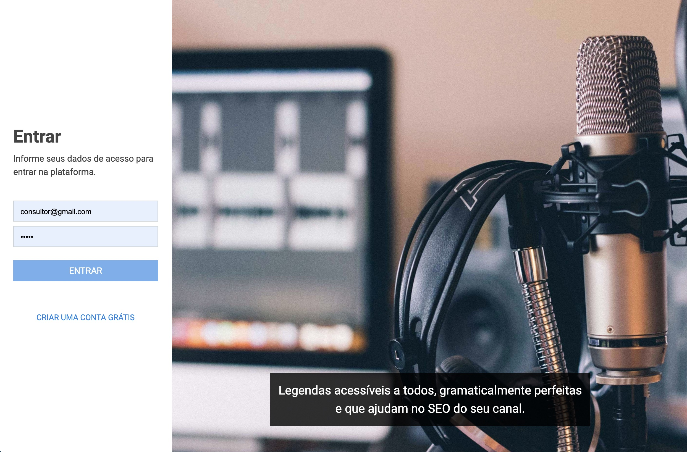
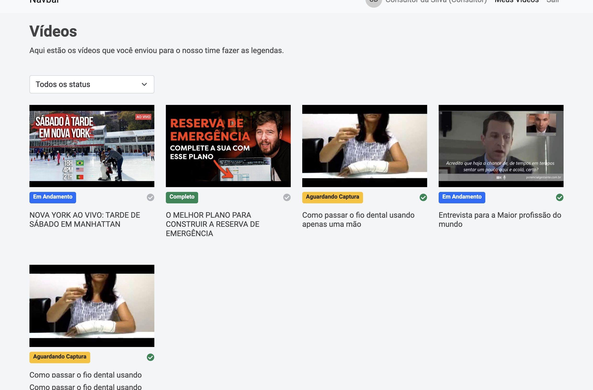
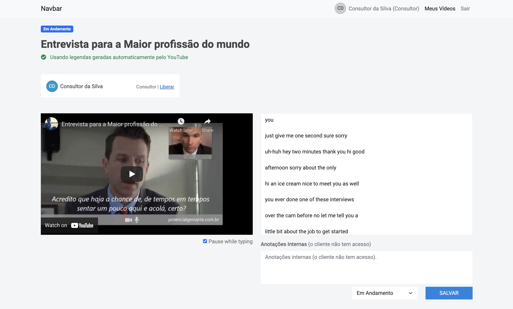
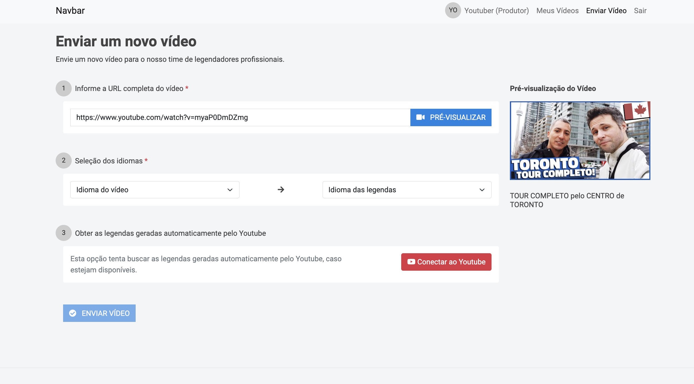

# Getting Started with Create React App

This project was bootstrapped with [Create React App](https://github.com/facebook/create-react-app) version 17.0.2.

## Development server

Run `npm start` for a dev server. Navigate to `http://localhost:9000/`. The app will automatically reload if you change any of the source files.

## Project description

Platform intended to help content producers (on Youtube or Vimeo) to get perfect subtitles and closed captions (CC) in their videos. Both, Youtube and Vimeo, has its own auto-generated subtitles but they are far way to be good enough.

This platform have two different access profiles: producer and consultant.

**Producers can:**

* Add Youtube videos to be subtitled
* Integrate with the Youtube API to get auto-generated subtitles
* Choose which type of subtitles is needed for each video (language, closed-caption, etc).
* Receive email notifications when video status has changed

**Consultants can:**

* See unassigned videos to work on
* Write subtitles using the auto-play/pause tool
* Change video status

This is a platform built for study purposes using Angular 12. The API is a headless CMS (Directus CMS) using NodeJS and MySQL.

# Screenshots

Login:

Consultants view with unassigned videos from all producers and only those videos his already started.

Consultants subtitle tool with auto-play/pause feature.

Producers submit video tool with auto-preview and integration with the Youtube API.
